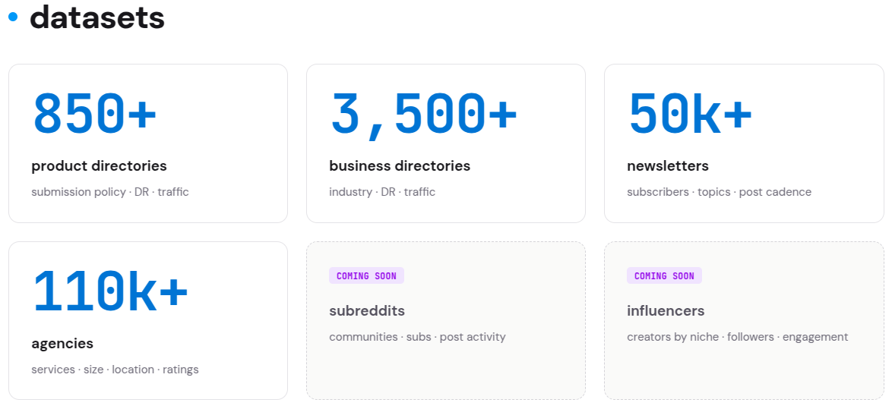

<p align="center">
  
</p>

# ServiceGraph Agent Skills

> **Datasets for founders** — where to launch, who to email, who to hire.

Agent Skills for [**ServiceGraph**](https://servicegraph.co) — structured,
metrics-enriched business datasets your agent can filter, rank, and pull
contact data from. One filter DSL, one credit balance, many datasets:

<p align="center">
  
</p>

| Dataset | Size | Enriched with |
|---|---|---|
| **Agencies** (US professional-services firms) | 110k+ | services · size · location · ratings |
| **Business directories** | 3,500+ | industry · domain rating · traffic |
| **Product directories** | 850+ | submission policy · domain rating · traffic |
| **Newsletters** | 50k+ | subscribers · topics · post cadence |
| _subreddits, influencers_ | _coming soon_ | |

**The branded `servicegraph` skill works against every dataset** — say
"servicegraph" and your agent discovers what datasets exist, learns each
one's schema and filters, searches free, and unlocks detail with credits.
**The specific `find-*` skills cover two datasets today.** For the **Agencies**
dataset — law, marketing, design, consulting, accounting, IT services, AI/ML,
web development, engineering, HR, PR, cybersecurity, and more — filterable by
industry, services, location, size, ratings, and third-party listings. And for
the **Product directories** dataset — where to *launch* a software product and
*earn backlinks* — covering general product/SaaS launches, MCP-server
registries, and AI-tool / AI-agent / agent-skill directories, ranked by Domain
Rating and organic traffic. More per-use-case skills for the newsletter and
other datasets land here as they ship — same install, same API key, same DSL.

Compatible with **19+ AI agents** including Claude Code, Codex, Cursor, GitHub
Copilot, Gemini, Cline, Goose, Windsurf, and any other harness that supports
the [Agent Skills](https://agentskills.io/) format.

## Installation

### Install a specific skill

```bash
npx skills add nostrband/servicegraph --skill find-service-providers
```

### Install all skills

```bash
npx skills add nostrband/servicegraph
```

**API key:** browsing, filtering, and brief cards are free, but every call
needs a key. Create one at
[**servicegraph.co/profile/api-keys**](https://servicegraph.co/profile/api-keys)
(2,000 free credits on signup, no card) and put it in your shell or
`.env.local` as `SERVICEGRAPH_API_KEY=vk_…`. Skills prompt for it on first
use and never read the value into the model's context.

## Available Skills

### Any dataset

<details open>
<summary><strong>servicegraph</strong> — the branded entry point</summary>

The generic, dataset-agnostic way to drive ServiceGraph. Launch it by naming
the brand; it discovers what datasets exist and each one's schema and filters
through the API, searches free brief rows, and unlocks contact + metric detail
with credits — no datasets or fields hardcoded, so it stays correct as new
data lands.

**Use when:**
- "Use ServiceGraph to find …"
- "What datasets does ServiceGraph have?"
- "Search ServiceGraph for … / look this up in ServiceGraph"
- "Pull contacts from ServiceGraph for these domains"
- The dataset you need has no specific skill below yet

</details>

### Agencies dataset

<details open>
<summary><strong>find-service-providers</strong> — the umbrella skill</summary>

Find, shortlist, vet, or enrich US professional-services firms across all 22
industries in the catalog — law, marketing, consulting, accounting, IT
services, architecture, engineering, HR, PR, design, and more.

**Use when:**
- "Find me three boutique IP law firms in California"
- "Build a longlist of 50 mid-size US management consultancies"
- "Here are 12 agency domains — pull contact info and confirm which are US-based"
- The user's intent doesn't fit a more specific skill below

</details>

<details>
<summary><strong>find-marketing-agency</strong></summary>

Find US marketing agencies — branding, content marketing, PPC/paid media,
social, email, performance/demand-gen, video production, full-service digital.
Auto-pins `industry:marketing_agency` so the agent doesn't have to.

**Use when:**
- "Shortlist three B2B branding agencies in California"
- "Find a PPC shop with ecommerce experience"
- "We need a content marketing partner for a SaaS launch"

</details>

<details>
<summary><strong>find-seo-agency</strong></summary>

Find US SEO agencies — technical, on-page/off-page, link-building,
content-led, local, ecommerce, B2B SEO, audits. Auto-pins
`industry:marketing_agency service_provided:seo`.

**Use when:**
- "Find me an SEO agency in Texas"
- "Shortlist three technical SEO consultancies for SaaS"
- Indirect phrasings: "organic traffic is flat", "improve our Google rankings"

</details>

<details>
<summary><strong>find-design-agency</strong></summary>

Find US design and creative agencies — graphic design, UX/UI, product
design, brand identity, packaging, illustration, motion design, creative
direction. Auto-pins `industry:design_creative`. Defers to
`find-marketing-agency` for marketing-led engagements where design is one
of several services, and to `find-web-developer` when the deliverable is a
built website rather than design assets.

**Use when:**
- "Find me a UX/UI design agency for our SaaS product"
- "Shortlist three brand-identity studios in NY for our rebrand"
- "Packaging design firm for a CPG launch"

</details>

<details>
<summary><strong>find-software-developer</strong></summary>

Find US software development firms — custom software, web/mobile development,
backend/API, DevOps/cloud consulting, system integration, hosting. Auto-pins
`industry:it_services`. Defers to `find-web-developer` for strictly
website/landing-page projects, and to `find-ai-consultancy` for AI/ML
modeling and data-engineering work.

**Use when:**
- "Find me a software dev shop in Austin"
- "Shortlist three custom-software firms with healthcare experience"
- "We need a mobile app developer for our iOS launch"

</details>

<details>
<summary><strong>find-web-developer</strong></summary>

Find US web development firms — building, refreshing, or rebuilding
marketing sites, landing pages, ecommerce, WordPress/Webflow/Shopify,
headless CMS, microsites, and web frontend work. Auto-pins
`industry:it_services service_provided:web-development`. Defers to
`find-software-developer` for backend/API/mobile work, and to
`find-marketing-agency` when scope spans broader marketing.

**Use when:**
- "Find a web developer for our marketing landing page"
- "Shortlist three Webflow agencies in California"
- "Rebuild our ecommerce site on Shopify with custom theme work"

</details>

<details>
<summary><strong>find-ai-consultancy</strong></summary>

Find US AI/ML and data consulting firms — AI/ML development, MLOps,
generative AI / LLM apps (RAG, chatbots, agents), computer vision, NLP,
recommendation systems, data engineering, BI/analytics. Auto-pins
`industry:data_ai_consulting`. Defers to `find-software-developer` for
general app/backend work where AI is just a feature.

**Use when:**
- "Find an AI/ML consulting firm to build our recommendation engine"
- "Three RAG/LLM consultancies for an enterprise chatbot project"
- Indirect: "we want to use AI to predict customer churn — who can help?"

</details>

<details>
<summary><strong>find-law-firm</strong></summary>

Find US **B2B** law firms — corporate, IP/patent, M&A and securities,
employment, commercial litigation, regulatory/compliance, data privacy/
cyber, real estate, tax. Auto-pins `industry:legal`. The catalog is
B2B-only — consumer-personal matters (divorce, personal injury, criminal
defense, estate planning, family law, wills) are explicitly out of scope.

**Use when:**
- "Find three boutique IP law firms in California for patent prosecution"
- "Shortlist M&A counsel for a Series-B fundraise"
- Indirect: "outside counsel for GDPR / SOC 2 oversight"

</details>

<details>
<summary><strong>find-cpa-firm</strong></summary>

Find US accounting and tax firms (CPA firms) — financial-statement audit,
SOC 1/2, corporate tax, bookkeeping for businesses, advisory/fractional
CFO, M&A diligence, 409A valuations, R&D tax credits, IPO readiness,
sales-and-use tax. Auto-pins `industry:accounting_tax`. B2B-only —
personal tax prep (1040, individual estate, retirement planning) is
out of scope.

**Use when:**
- "Find me a CPA firm for our Delaware C-corp Series A audit"
- "Shortlist three audit firms with SaaS experience"
- Indirect: "our books are a mess and we need someone to clean them up
  before the audit"

</details>

<details>
<summary><strong>find-management-consultant</strong></summary>

Find US management consultancies — strategy, operations, executive
coaching, leadership development, org-development/change management,
PMO/program management, sales/revenue ops. Auto-pins
`industry:management_consulting` and uses the `service_provided`
sub-tags (`strategy-consulting`, `operations-consulting`, etc.).

**Use when:**
- "Find me three top strategy consultancies in California for a Series-B SaaS"
- "We need an executive coach for our new CEO"
- Indirect: "change-management partners for a post-merger integration"

</details>

<details>
<summary><strong>find-engineering-firm</strong></summary>

Find US **real-world** engineering firms — civil, structural, MEP,
mechanical, electrical, geotechnical, transportation, environmental,
manufacturing. Auto-pins `industry:engineering_services`. **NOT for
software engineering** — defers software-dev / "engineering team" /
SaaS-architecture asks to `find-software-developer`. Skips residential
or consumer architecture asks.

**Use when:**
- "Find civil engineering firms in Florida for transportation infrastructure"
- "Shortlist three structural engineering firms with high-rise experience"
- Indirect: "we're building a 10-story office and need a structural engineer
  to stamp the drawings"

</details>

<details>
<summary><strong>find-recruiting-firm</strong></summary>

Find US recruiting and staffing firms — executive search/retained search,
RPO, tech/sales/healthcare recruiting, contingent/contract staffing, temp
staffing. Auto-pins `industry:hr_recruiting_staffing`. **Procures an
external recruiting firm** — does NOT fire on recruiting-an-employee
asks ("hire a recruiter for our team", "where should I post the job"),
candidate-side asks, or in-house recruiter hires.

**Use when:**
- "Find me an executive search firm for a CFO search"
- "We need RPO support for a 50-engineer hiring push"
- Indirect: "we're scaling fast and need help hiring at scale"

</details>

<details>
<summary><strong>find-pr-agency</strong></summary>

Find US public-relations and communications agencies — media relations,
crisis comms, investor relations (IR), product-launch PR, tech/startup
PR, healthcare PR, B2B PR, public affairs, brand reputation, internal
communications. Pins `service_provided:public-relations`. Defers to
`find-marketing-agency` when scope spans broader marketing beyond
PR/comms.

**Use when:**
- "Find me a tech PR agency in NY for our Series-B announcement"
- "Three IR firms for our upcoming IPO roadshow"
- Indirect: "we need press — get us into TechCrunch, WSJ, the trade press"

</details>

<details>
<summary><strong>find-cybersecurity-firm</strong></summary>

Find US cybersecurity firms — pen-testing/red team, security audits,
vCISO, SOC 2 readiness, incident response, managed SOC, IAM, cloud
security, AppSec. Pins `service_provided:cybersecurity`. B2B-only
— consumer-personal cybersecurity ("my Gmail got hacked", "secure my
home wifi") is out of scope.

**Use when:**
- "Find me a pen-testing firm for our SOC 2 audit"
- "We need an incident response retainer"
- Indirect: "we got hit with ransomware last week — we need help fast"

</details>

### Product directories dataset

Each row is a **directory you submit to** — not a firm and not a product.
These skills answer *where to launch a software product and earn backlinks*:
they rank listing sites by **Domain Rating** (free in every result, so you
shortlist for zero credits) and unlock the **submission note** (how to submit,
and whether the listing grants a backlink) plus organic traffic with credits.
Global catalog, not US-only.

<details open>
<summary><strong>find-product-directories</strong> — the umbrella</summary>

Find and rank directories to submit a **SaaS, software product, app, or
startup** to — SaaS review sites, launch platforms (Product Hunt and its
alternatives), and general software directories. Defers to
`find-mcp-directories` and `find-ai-directories` for those niches.

**Use when:**
- "Where can I submit my B2B SaaS to get backlinks and launch-day traffic?"
- "Give me a list of Product Hunt alternatives to launch our app on"
- "Here are 10 software directory domains — pull submission details and rank by DR"

</details>

<details>
<summary><strong>find-mcp-directories</strong></summary>

Find and rank **MCP-server registries** (Model Context Protocol) — where to
publish a server so agent builders discover it, ranked by domain authority.

**Use when:**
- "Where do I list my MCP server?"
- "Best MCP directories and registries to submit our server to for backlinks"
- Indirect: "we just built an MCP server — where do we publish it?"

</details>

<details>
<summary><strong>find-ai-directories</strong></summary>

Find and rank directories for **AI tools, AI agents, and agent skills /
plugins** — where to list an AI product for backlinks and discovery. Defers to
`find-mcp-directories` when the artifact is specifically an MCP server.

**Use when:**
- "Where can I list my AI tool to get backlinks and discovery?"
- "Directories to submit my AI agent / where do I publish our agent skill?"
- "Rank the top AI tool directories by domain rating for our SEO push"

</details>

## Prefer MCP? Use the hosted server.

If your harness speaks the [Model Context Protocol](https://modelcontextprotocol.io/),
skip the skill install and point it at the hosted MCP server:

```
https://mcp.servicegraph.co
```

- **Transport:** Streamable HTTP
- **Auth:** OAuth 2.1 + PKCE with Dynamic Client Registration — your harness
  opens a browser tab on first use; you sign in on `servicegraph.co` and are
  bounced back. No client ID or secret to copy around, no API key to paste.

### Claude Code

```bash
claude mcp add --transport http servicegraph https://mcp.servicegraph.co
```

### Claude Desktop

**Settings → Connectors → Add custom connector**, then paste:

```
https://mcp.servicegraph.co
```

The OAuth handshake runs in your browser on first use.

### Codex CLI

`~/.codex/config.toml`:

```toml
[mcp_servers.servicegraph]
url = "https://mcp.servicegraph.co"
```

### Cursor and other JSON-config clients

`.cursor/mcp.json` (or the equivalent for your harness):

```json
{
  "mcpServers": {
    "servicegraph": {
      "url": "https://mcp.servicegraph.co"
    }
  }
}
```

## Usage

Skills are automatically available once installed. The agent will pick the
right one when it detects a relevant task.

**Examples:**

```
Find me three boutique IP law firms in California that handle patent
prosecution for hardware startups.
```

```
Need a shortlist of mid-size SEO agencies in NY or NJ with a strong B2B
SaaS portfolio.
```

```
We're hiring a CPA firm for a Delaware C-corp Series A audit.
Recommend 5 options under 50 people.
```

```
Here are 12 marketing agency domains I scraped — pull contact info and
confirm which are in the US.
```

## How it works — browse free, unlock with credits

Every dataset lives behind the same per-dataset URL shape and the same
filter DSL. For the agencies dataset the id is `pro_services`:

```
GET  /v1/datasets/pro_services/fields    →  field catalog + DSL grammar · free
GET  /v1/datasets/pro_services/check     →  validate a filter · free
GET  /v1/datasets/pro_services/search    →  brief firm cards · free
GET  /v1/datasets/pro_services/{apex}    →  one row (brief; detail if unlocked) · free
POST /v1/datasets/pro_services/unlocks   →  full contact bundle · 10 credits/row
```

Discovery, filtering, and brief cards are **free** — you only spend credits
to unlock a row's full contact detail (URL, phone, email, social, address).
An unlock lasts **30 days** and re-fetching within that window is free.

- **2,000 free credits on signup**, no card.
- **10 credits per row** (~$0.10). Top-ups: $10 / 1,000 credits, $80 / 10,000
  (20% off). **Credits never expire.**

### Filter DSL

One query parameter, GitHub-search-style. AND binds tighter than OR;
`-x` / `NOT x` for negation; `tag@evidence` for the `service_provided` field.
Any bareword is a free-text keyword search across firm name, brand, title,
meta description, and legal name.

```
industry:legal state:CA,NY -company_size_signal:solo
industry:management_consulting service_provided:strategy-consulting@high
dental industry:marketing_agency
rating>=4 review_count_total>=20 has:clutch
(web3 OR blockchain) state:CA
```

The field catalog (kinds, operators, allowed values) is discoverable at
runtime via
[`/v1/datasets/pro_services/fields`](https://api.servicegraph.co/v1/datasets/pro_services/fields).

## Why structured beats search

- **Filter, don't grep.** Industry, services, location, size, rating,
  domain authority, traffic, third-party listings — all queryable as a single
  filter string, not a wall of fuzzy web results.
- **Metrics built in.** Every row carries the signals you'd otherwise scrape
  by hand — agency ratings, directory DR/traffic, newsletter subscriber
  counts — so an agent can rank, not just list.
- **Cheaper than scraping.** Browse and filter for free; pay only for the
  contact rows you actually want, ~$0.10 each, 30-day access, credits never
  expire. Beats Google, ChatGPT guesses, and stale Notion/Twitter lists.

## Skill structure

Each skill follows the [Agent Skills Open Standard](https://agentskills.io/):

- `SKILL.md` — required manifest with frontmatter (name, description, metadata)

The skills in this repo are single-file. No bundled scripts or references
yet — the API is small enough that the agent does fine with prose +
copy-pasteable curl examples.

## Links

- [API console & docs](https://docs.servicegraph.co)
- [OpenAPI 3.1 spec](https://api.servicegraph.co/openapi.json)
- [Create an API key](https://servicegraph.co/profile/api-keys)
- [llms.txt](https://servicegraph.co/llms.txt)
- [Site](https://servicegraph.co)

## Community

- [Dev.to](https://dev.to/brugeman)
- [X.com](https://x.com/briugemanai)

## See also

- [Product directories](https://servicegraph.co/product-directories)
- [MCP directories](https://servicegraph.co/blog/best-mcp-directories-2026)
- [Agent skills directories](https://dev.to/brugeman/where-to-publish-your-ai-agent-skills-discovery-hubs-and-directories-5l7)
- [ProductHunt](https://www.producthunt.com/@arturbrugeman)

## License

MIT

## Contact

[artur@servicegraph.co](mailto:artur@servicegraph.co)
